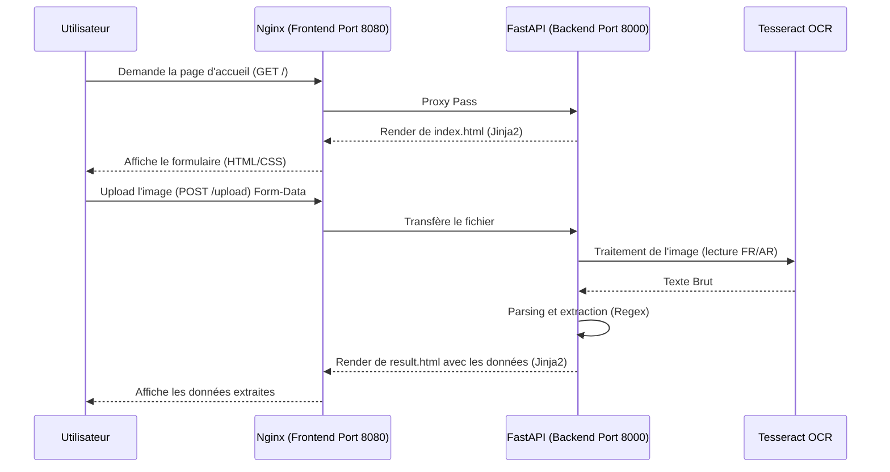
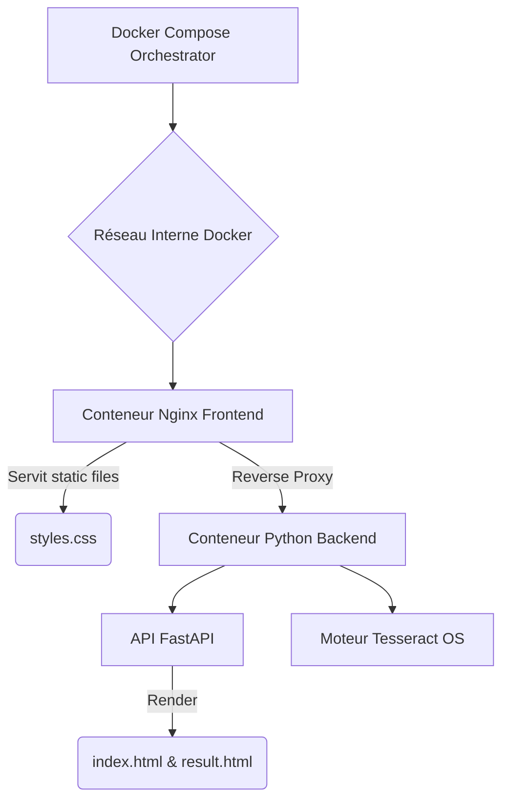

# 🏦 ChekScan : Reconnaissance Automatique de Chèques (PFE OCR)

<div align="center">
  
  
  
  
</div>

<br/>

## 📋 Table des matières
- [1. Introduction et Contexte](#1-introduction-et-contexte)
- [2. Fonctionnalités Clés](#2-fonctionnalités-clés)
- [3. Architecture de la Solution (Diagrammes)](#3-architecture-de-la-solution-diagrammes)
- [4. Guide Rapide : Tester en Local avec Docker](#4-guide-rapide--tester-en-local-avec-docker)
- [5. 🚀 Guide de Déploiement en Ligne](#5--guide-de-déploiement-en-ligne)

---

## 1. Introduction et Contexte
**ChekScan** est un Projet de Fin d'Études (PFE) conçu pour automatiser la saisie des chèques bancaires via des algorithmes de vision par ordinateur.
Afin de garantir une fiabilité totale, une haute sécurité, et respecter des standards académiques rigides, l'application est conçue **sans JavaScript côté client**. Toute la logique et le rendu (Jinja2) sont centralisés sur un puissant backend Python (FastAPI).

---

## 2. Fonctionnalités Clés
- 📸 **Extraction OCR Intelligente** : Reconnaissance optique de caractères via Google Tesseract.
- 🎯 **Analyse Sémantique (Regex)** : Identification automatique de la banque, de la ligne magnétique (MICR/CMC7), des montants et des dates.
- 🛡️ **Sécurité Zéro-JS** : Le frontend est uniquement composé de HTML sémantique et de CSS (Vanilla). Les données ne sont jamais traitées via JavaScript.
- ✨ **Interface Premium (Glassmorphism)** : Design UI/UX moderne, propre et fluide uniquement avec du CSS natif.
- 🐳 **Déploiement Conteneurisé** : Séparation Front/Back propre avec orchestrateur `docker-compose`.

---

## 3. Architecture de la Solution (Diagrammes)

### Structure Découplée Front / Back
Ce diagramme détaille comment l'absence de JS transfère la responsabilité du rendu au backend API.



### Architecture Docker


---

## 4. Guide Rapide : Tester en Local avec Docker

1. **Cloner le dépôt** :
   ```bash
   git clone https://github.com/Lina-Zrewil/My_app.git
   cd My_app
   ```
2. **Lancer les conteneurs** :
   ```bash
   docker-compose up -d --build
   ```
   *Ceci installera automatiquement Python, FastAPI, Tesseract, et Nginx.*
3. **Accéder à l'application** :  Ouvrez votre navigateur sur **[http://localhost:8080](http://localhost:8080)**.

---

## 5. 🚀 Guide de Déploiement en Ligne

L'application ChekScan requiert un environnement avec *Tesseract-OCR* installé au niveau du système (ce que ne proposent pas les hébergeurs "Serverless" standards comme Vercel). 
L'approche moderne pour déployer ce type d'application est d'utiliser un service qui supporte nos conteneurs **Docker**.

### Option recommandée (Gratuite) : Render.com

Render.com vous permet de déployer l'intégralité du `docker-compose` en hébergeant automatiquement l'image Docker contenant Python + Tesseract.

**Étape par étape :**
1. Envoyez tout ce code sur votre compte GitHub (`Lina-Zrewil/My_app`).
2. Créez un compte gratuit sur **[Render.com](https://render.com/)**.
3. Cliquez sur le bouton **"New"** puis choisissez **"Web Service"**.
4. Liez votre compte GitHub et sélectionnez votre dépôt `My_app`.
5. Render détectera automatiquement le fichier `Dockerfile` présent dans le projet.
6. Dans la section "Environment", assurez-vous de choisir l'option Docker. 
   *(Si Render vous demande quel Dockerfile exécuter dans un monorepo, pointez-le vers le dossier `./backend/Dockerfile` pour déployer l'API).*
7. Cliquez sur **"Create Web Service"**.

*La phase de build prendra de 3 à 5 minutes (le temps d'installer Tesseract). Une fois terminée, Render vous donnera une URL publique (ex: `https://my-app-ocr.onrender.com`) accessible partout dans le monde !*
