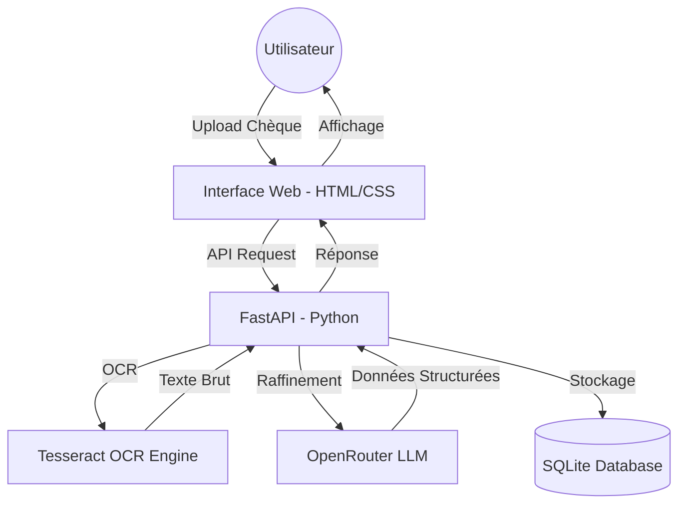

# 🏦 ChekScan : Système Intelligent de Numérisation de Chèques

**ChekScan** est une plateforme moderne permettant d'automatiser la lecture et la gestion des chèques bancaires marocains. Grâce à une intelligence artificielle avancée (OCR Tesseract + OpenRouter LLM), l'application extrait instantanément les informations critiques pour simplifier vos processus financiers.

---

## 🏛️ Architecture du Système

### Flux de Données et Composants


---

## ✨ Fonctionnalités
- 📸 **Numérisation Automatisée** : Analyse instantanée des images de chèques (JPG, PNG).
- 🎯 **Extraction de Données** : Identification automatique de la banque, du montant, de la date et du code MICR.
- 🏢 **Spécialisation Maroc** : Optimisé pour les banques marocaines (Attijariwafa, CIH, BCP, BOA, etc.).
- 💾 **Historique des Scans** : Sauvegarde sécurisée de chaque opération.
- 🌓 **Interface Premium** : Design contemporain avec mode Clair/Sombre et effets Glassmorphism.
- 🤖 **Assistant Chatbot** : Discutez avec vos données pour obtenir des analyses bancaires.

---

## 📁 Structure du Projet

```text
maghreb-check-ai/
├── .github/workflows/      # Automatisation GitHub Actions (CI/CD)
│   └── docker-publish.yml  # Publication vers GitHub Packages (GHCR)
├── backend/                # Logique Python (FastAPI, OCR, DB)
│   ├── data/               # Dossier pour SQLite et Logs (Persistance)
│   ├── main.py             # Point d'entrée de l'API
│   └── Dockerfile          # Image Backend
├── frontend/               # Interface Utilisateur (HTML/CSS/Images)
│   ├── index.html          # Page principale
│   └── styles.css          # Design Premium
├── docker-compose.yml      # Orchestration pour développement
├── docker-compose.prod.yml # Orchestration pour production (Cloudflare)
└── README.md               # Documentation
```

---

## 🚀 Déploiement Professionnel (Auto-Hébergement)

Ce projet utilise une stratégie de déploiement moderne :

### 1. GitHub Packages (GHCR)
Chaque "push" sur la branche principale déclenche une action GitHub qui construit et stocke les images Docker de manière privée ou publique sur GitHub.
- **Image Backend** : `ghcr.io/votre-user/maghreb-check-ai-backend`
- **Image Frontend** : `ghcr.io/votre-user/maghreb-check-ai-frontend`

### 2. Cloudflare Tunnel
Plus besoin de Render ou Railway ! L'application tourne sur votre machine et Cloudflare Tunnel crée un pont sécurisé vers votre nom de domaine.

**Installation Rapide :**
1. Copiez `.env.example` en `.env` et remplissez vos clés.
2. Lancez la production :
   ```bash
   docker-compose -f docker-compose.prod.yml up -d
   ```

---

## 🛠️ Technologies
- **Backend** : FastAPI, Pytesseract, Pillow, SQLite.
- **Frontend** : Vanilla HTML5, CSS3 (Glassmorphism), JavaScript-free logic.
- **DevOps** : Docker, Docker Compose, GitHub Actions, Cloudflare Tunnels.

---

© 2026 ChekScan - Conçu pour une excellence bancaire numérique. 🇲🇦

