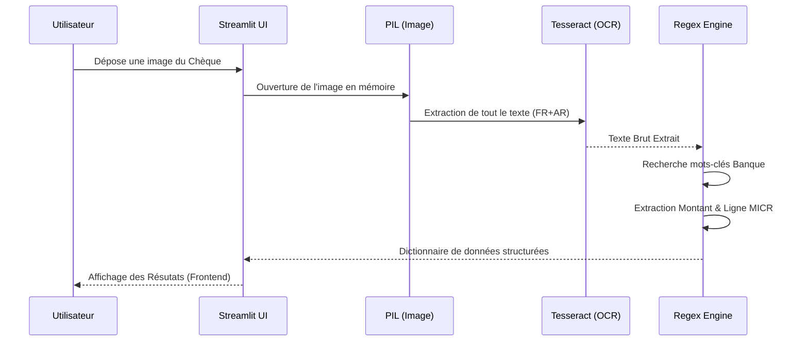
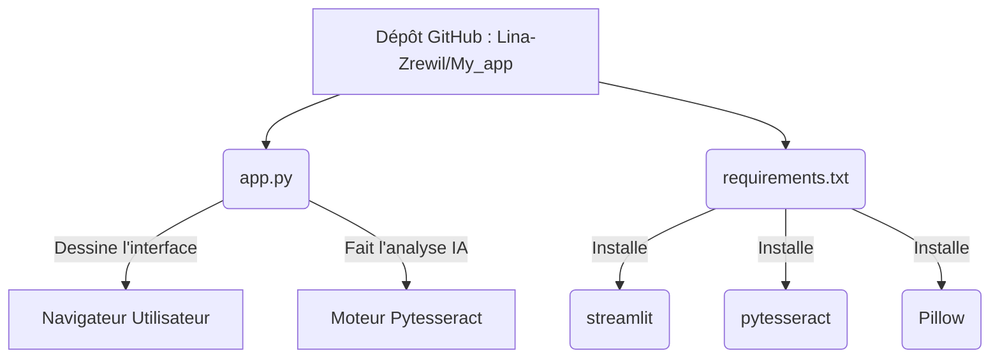

# 🏦 Cheko : PFE OCR-CHEQUES - 100% Python

<div align="center">
  
  
  
</div>

<br/>

## 📋 Table des matières
- [1. Introduction et Contexte](#1-introduction-et-contexte)
- [2. Fonctionnalités Clés](#2-fonctionnalités-clés)
- [3. Architecture de la Solution (Diagrammes)](#3-architecture-de-la-solution-diagrammes)
- [4. Guide Rapide : Tester en Local](#4-guide-rapide--tester-en-local)
- [5. 🚀 DÉPLOIEMENT : Comment Mettre l'App en Ligne (Gratuit)](#5--déploiement--comment-mettre-lapp-en-ligne-gratuit)

---

## 1. Introduction et Contexte
**Cheko** est le fruit d'un Projet de Fin d'Études (PFE) visant à digitaliser et accélérer le traitement des chèques bancaires, particulièrement au Maroc.
Contrairement aux architectures web traditionnelles complexes, cette version utilise **Streamlit** pour offrir une interface utilisateur complète, esthétique et réactive **directement codée en Python**.

---

## 2. Fonctionnalités Clés
- 📸 **Extraction OCR Intelligente** : Reconnaissance optique de caractères via Google Tesseract.
- 🎯 **Analyse Sémantique (Regex)** : Identification automatique de la banque (CIH, Attijari, etc.), de la ligne magnétique (MICR/CMC7), des montants et des dates.
- 🤖 **Chatbot Intégré** : Assistant disponible dans la barre latérale.
- 🐍 **Zéro JavaScript/HTML/CSS** : Un code unifié et facile à maintenir pour les data scientists.

---

## 3. Architecture de la Solution (Diagrammes)

Voici comment Cheko traite une image de chèque, de l'envoi par l'utilisateur à l'affichage des données.



### Arborescence Simplifiée


---

## 4. Guide Rapide : Tester en Local

Si vous avez Python et Tesseract installés sur votre ordinateur (Windows/Mac/Linux) :
1. Installez les librairies : `pip install -r requirements.txt`
2. Lancez l'application : `streamlit run app.py`

---

## 5. 🚀 DÉPLOIEMENT : Comment Mettre l'App en Ligne (Gratuit)

Puisque tout le code est dans ce dépôt GitHub et 100% en Python, le moyen le plus simple professionnel pour avoir l'application disponible via une URL publique consiste à utiliser **Streamlit Community Cloud** (Hébergement gratuit).

### Étape par Étape :
1. Assurez-vous que tous les fichiers (surtout `app.py` et `requirements.txt`) sont bien sur votre dépôt GitHub `Lina-Zrewil/My_app`.
2. Allez sur **[share.streamlit.io](https://share.streamlit.io/)**.
3. Cliquez sur **Continue with GitHub** et autorisez Streamlit à lire vos dépôts.
4. Cliquez sur le bouton bleu **New app**.
5. Remplissez le petit formulaire :
   - **Repository** : Sélectionnez `Lina-Zrewil/My_app`.
   - **Branch** : Laissez sur `main` (ou `master`).
   - **Main file path** : Écrivez `app.py`.
6. Cliquez sur **Deploy !**

*Note Technique Critique :* Le serveur de Streamlit Cloud est sous Linux. Lorsqu'il lira le `requirements.txt`, il installera Python. Mais pour installer le logiciel "Tesseract OCR" sur le serveur Streamlit, il faut **ajouter un fichier spécial** à la racine de votre dépôt GitHub.
Créez un fichier nommé exactement `packages.txt` dans votre dépôt et mettez-y ce contenu :
```text
tesseract-ocr
tesseract-ocr-fra
tesseract-ocr-ara
```
(Streamlit lira ce fichier automatiquement et installera Tesseract sur leur serveur !).
